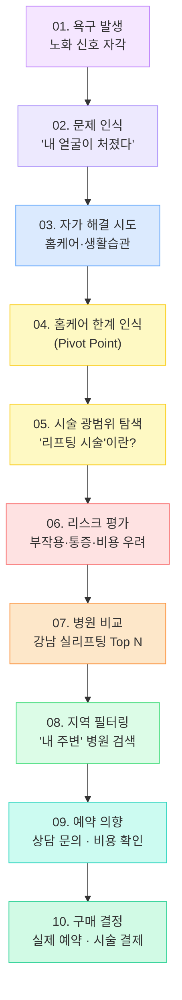

# 🧠 팽팽클리닉: 실리프팅 고객 구매 여정 10단계 퍼널 전략
## 안티에이징 욕구 발생 → 실리프팅 구매 결정까지

> **핵심 전제:** 고객은 "실리프팅"을 목적으로 오지 않는다. **"젊어 보이고 싶다"**는 욕구에서 시작하여, 우리가 각 단계에서 올바른 콘텐츠와 접점을 제공할 때 팽팽클리닉을 자연스럽게 선택하게 된다.

---

## 📊 10단계 퍼널 전체 Map

---

## 📋 단계별 상세 정의 & 팽팽클리닉 대응 전략

### 01단계. 욕구 발생 — *"나 요즘 왜 이렇게 늙어 보이지?"*
**고객 상태:** 사진 속 자신, 거울, 지인의 말에서 노화 신호를 처음 인식  
**검색 키워드:** `얼굴 처짐`, `나이 들어 보이는 이유`, `피부 탄력 저하`  
**우리의 역할:** 노출(Awareness) — 욕구를 자극하는 콘텐츠

| 채널 | 콘텐츠 방향 |
|:---|:---|
| Instagram · Reels | "이 3가지가 당신을 늙어 보이게 만든다" |
| Naver 블로그 | `얼굴 처짐 원인 총정리` SEO 아티클 |
| Threads | "오늘 셀카 찍다 깜짝 놀란 순간" 공감형 텍스트 |

---

### 02단계. 문제 인식 — *"볼 처짐·팔자주름 이 정도면 심각한 건가?"*
**고객 상태:** 막연한 불만이 구체적 고민으로 전환  
**검색 키워드:** `볼 처짐 심한가`, `팔자주름 심해지는 나이`, `턱선 없어지는 이유`  
**우리의 역할:** 문제를 정량화하고 심각성 인식시키기

| 채널 | 콘텐츠 방향 |
|:---|:---|
| YouTube Shorts | "나이별 얼굴 처짐 자가진단 테스트" |
| Naver 블로그 | `볼 처짐 자가진단 5단계` — CTA: 상담 링크 |
| Instagram 카드뉴스 | "30대 vs 40대 vs 50대 얼굴 처짐 비교" |

---

### 03단계. 자가 해결 시도 — *"일단 홈케어 제품으로 해보자"*
**고객 상태:** 시술 전에 저비용 해결책으로 피부 관리 제품·기기 시도  
**검색 키워드:** `피부 탄력 음식`, `홈케어 리프팅 기기 추천`, `페이스 요가`  
**우리의 역할:** 홈케어 정보를 제공하되 팽팽클리닉 브랜드 심기

| 채널 | 콘텐츠 방향 |
|:---|:---|
| Naver 블로그 | `피부과 원장이 알려주는 진짜 효과 있는 홈케어 루틴` |
| Instagram | 홈케어 팁 공유 → 마지막 슬라이드: "이것만으로 부족할 때" |

---

### 04단계. 홈케어 한계 인식 (Pivot Point) — *"이걸로는 안 되겠는데..."*
**고객 상태:** 홈케어로는 한계를 느끼고 전문 시술 탐색으로 전환  
**검색 키워드:** `홈케어 리프팅 기기 효과 없음`, `셀프 리프팅 한계`, `피부과 가야하나`  
**우리의 역할:** ⚡ 이 단계가 핵심 전환점 — 시술로의 브릿지 역할

| 채널 | 콘텐츠 방향 |
|:---|:---|
| Naver 블로그 | `홈케어 리프팅 기기 vs 실제 시술 - 원장이 비교해봄` |
| YouTube | "홈케어로 안 되는 이유 (원장님 직강)"  |
| Meta 광고 | 리타겟팅: 홈케어 관련 콘텐츠 열람자 대상 시술 광고 |

---

### 05단계. 시술 광범위 탐색 — *"어떤 시술이 있지?"*
**고객 상태:** 리프팅 시술 전반에 대한 정보 수집 — 울쎄라, 써마지, 실리프팅 비교  
**검색 키워드:** `리프팅 시술 종류`, `울쎄라 vs 실리프팅`, `실 리프팅이란`, `써마지 효과`  
**우리의 역할:** 정보 제공자(Expert)로 포지셔닝 — 자연스럽게 실리프팅으로 유도

| 채널 | 콘텐츠 방향 |
|:---|:---|
| Naver 블로그 (SEO) | `2026년 리프팅 시술 완전 비교 (울쎄라/써마지/실리프팅)` |
| YouTube | "어떤 리프팅이 나한테 맞을까? 원장님이 분류해줌" |
| 강남언니/바비톡 | 실리프팅 시술 상세 페이지 최적화 |

---

### 06단계. 리스크 평가 — *"혹시 부작용은? 얼마나 아파? 얼마야?"*
**고객 상태:** 시술에 관심 있지만 두려움·의심 단계 — 이탈 위험 최고  
**검색 키워드:** `실리프팅 부작용`, `실리프팅 통증`, `실리프팅 비용`, `실리프팅 얼마나 지속`  
**우리의 역할:** ⚠️ 두려움 해소가 핵심 — 솔직한 정보 + 신뢰 구축

| 채널 | 콘텐츠 방향 |
|:---|:---|
| Naver 블로그 | `실리프팅 부작용 - 원장이 솔직하게 알려드림` (신뢰 콘텐츠) |
| YouTube Shorts | "실리프팅 시술 당일 리얼 후기 (통증 수준 포함)" |
| 인스타 Q&A | 원장 라이브: "실리프팅 부작용 질문 다 받음" |
| 경쟁사 모니터링 | 경쟁사 부작용 리뷰 포착 → 우리 안전성 강조 콘텐츠 즉시 대응 |

---

### 07단계. 병원 비교 — *"어느 병원이 잘해?"*
**고객 상태:** 시술을 받기로 마음먹고 병원을 비교하는 단계  
**검색 키워드:** `강남 실리프팅 잘하는 병원`, `실리프팅 유명한 피부과`, `팽팽클리닉 실리프팅`  
**우리의 역할:** 경쟁에서 이기기 — 리뷰 수·전문성·차별성 강조

| 채널 | 콘텐츠 방향 |
|:---|:---|
| 네이버 스마트플레이스 | 리뷰 최대화, Before/After 사진 최신화 |
| 강남언니/바비톡 | 시술 건수·원장 경력 최신화, 이벤트 등록 |
| Naver 블로그 | `팽팽클리닉 실리프팅 후기 (원장 직접 시술)` |
| Meta 광고 | 경쟁 병원 방문자 리타겟팅 광고 |

---

### 08단계. 지역 필터링 — *"신사·압구정 쪽 병원 찾아보자"*
**고객 상태:** 지역 기반 검색으로 최종 후보 목록 압축  
**검색 키워드:** `신사동 실리프팅`, `압구정 피부과 실리프팅`, `강남역 근처 리프팅`  
**우리의 역할:** 로컬 SEO 최적화 — 지역 검색에서 1순위에 노출

| 채널 | 콘텐츠 방향 |
|:---|:---|
| 네이버 스마트플레이스 | `신사동 실리프팅` 키워드 최적화, 영업시간·주차 정보 최신화 |
| 카카오·티맵 | 목적지 등록, 키워드 최적화 |
| Naver 블로그 | `신사역 팽팽클리닉 오시는 길 + 주차 완벽 가이드` |
| Google 내 장소 | 구글 맵 리뷰 & 키워드 최적화 |

---

### 09단계. 예약 의향 — *"한번 상담이나 받아볼까?"*
**고객 상태:** 거의 결정 직전 — 비용 확인·상담 예약 타진  
**검색 키워드:** `팽팽클리닉 상담`, `실리프팅 이벤트`, `실리프팅 첫 방문 할인`  
**우리의 역할:** 🎯 마찰 제거(Friction Removal) — 즉시 상담 진입 유도

| 채널 | 콘텐츠 방향 |
|:---|:---|
| 카카오 채널 | 빠른 답변 + 자동 첫 상담 할인 쿠폰 발급 |
| 강남언니/바비톡 | 첫 방문 이벤트 등록, 상담 신청 버튼 최적화 |
| 네이버 예약 | 24시간 온라인 예약 활성화 |
| SMS/Kakao 리타겟 | 웹사이트 방문 후 미예약자 → D+1, D+3 자동 알림 |

---

### 10단계. 구매 결정 — *"팽팽클리닉으로 정했다"*
**고객 상태:** 시술 예약 완료 → 구매 결정  
**우리의 역할:** 구매 경험 극대화 + 재방문·추천 유도 설계

| 채널 | 콘텐츠 방향 |
|:---|:---|
| EMR·CRM | D+1 사후관리 안내 자동 발송 |
| 카카오 | D+30 "경과 어떠세요?" + 추가 시술 안내 |
| SNS 연동 | 동의 하에 시술 후기 SNS 활용 (리뷰 콘텐츠화) |
| 추천 프로그램 | "친구 추천 시 양측 할인" 자동 발송 |

---

## 📅 분기별 퍼널 가중치 전략

> 계절과 이벤트에 따라 **집중 공략 단계가 달라진다.**

| 분기 | 시즌 특성 | 핵심 타겟 단계 | 집중 전략 |
|:---|:---|:---|:---|
| **Q1 (1~3월)** | 새해 결심 · 설날 전후 · 졸업/입학 시즌 | **01~03단계** (욕구·문제 인식) | "새해에는 달라진 나" · 봄맞이 변신 욕구 자극 콘텐츠 집중 |
| **Q2 (4~6월)** | 봄 야외 활동 증가 · 결혼식 시즌 | **04~06단계** (탐색·리스크 평가) | 결혼식·여행 전 D-day 타이밍 공략 · 부작용 불안 해소 콘텐츠 |
| **Q3 (7~9월)** | 여름 휴가 후 · 가을 준비 | **07~08단계** (병원 비교·지역 검색) | 경쟁사 비교 우위 콘텐츠 · 추석 전 이벤트 · 지역 SEO 강화 |
| **Q4 (10~12월)** | 연말 파티 · 크리스마스 · 새해 D-day | **09~10단계** (예약·결제) | 연말 특가 이벤트 집중 · 선물권(Gift Voucher) 도입 · 재방문 CRM 가동 |

---

## 🔄 Daily / Weekly / Monthly 모니터링 항목

### 📆 Daily (매일 오전 8시 자동 수집)

| 퍼널 단계 | 모니터링 항목 | 데이터 소스 |
|:---|:---|:---|
| 01~03단계 | `얼굴 처짐`, `홈케어 기기` 네이버 검색량 변화 | Naver DataLab |
| 05~06단계 | 경쟁사 부작용 리뷰 신규 발생 여부 | Review Crawler |
| 07~08단계 | 우리 스마트플레이스 노출 순위 & 리뷰 신규 등록 | Naver API |
| 09~10단계 | 신규 카카오 문의 수, 온라인 예약 건수 | CRM / Kakao |
| 전 단계 | 경쟁사 10곳 신규 블로그/SNS 포스팅 | Blog Crawler |

### 📅 Weekly (매주 월요일 오전 자동 생성)

| 퍼널 단계 | 모니터링 항목 | 분석 방향 |
|:---|:---|:---|
| 01~04단계 | 욕구/탐색 키워드 트렌드 주간 변화 | 계절성 및 이슈 포착 |
| 05~06단계 | 실리프팅 관련 콘텐츠 SOV (Share of Voice) | 우리 vs 경쟁사 노출 비율 |
| 07~08단계 | 경쟁사 이벤트·프로모션 변경 사항 | 즉각 대응 이벤트 기획 |
| 09~10단계 | 주간 상담 전환율, 예약 전환율, 시술 완료 건수 | 퍼널 병목 구간 파악 |

### 🗓️ Monthly (매월 1일 자동 생성)

| 퍼널 단계 | 모니터링 항목 | 분석 방향 |
|:---|:---|:---|
| 전 단계 | 퍼널별 고객 분포 변화 (어느 단계에 가장 많이 머무는가) | 전략 조정 |
| 03~04단계 | 홈케어 → 시술 전환 비율 | 콘텐츠 효율 측정 |
| 07~08단계 | SOV 순위 변화, 강남언니/바비톡 랭킹 변화 | 경쟁 위치 파악 |
| 09~10단계 | 월간 매출, 시술별 수익, 재방문율 | P&L 분석 |
| 전 단계 | AI(ChatGPT·Gemini) 실리프팅 추천 시 팽팽클리닉 언급 빈도 | AEO(AI Engine Optimization) |

---

## 🎯 핵심 KPI 요약

| KPI | 측정 방법 | 목표 |
|:---|:---|:---|
| 퍼널 진입율 (01단계) | 브랜드 콘텐츠 노출 횟수 | 월 10만 노출 |
| 탐색 → 관심 전환율 (04→05단계) | 리프팅 시술 관련 콘텐츠 클릭률 | 3% 이상 |
| 관심 → 상담 전환율 (08→09단계) | 스마트플레이스 클릭 → 문의 비율 | 10% 이상 |
| 상담 → 예약 전환율 (09→10단계) | 상담 건수 대비 예약 건수 | 60% 이상 |
| 재방문율 | 6개월 내 재방문 비율 | 40% 이상 |
