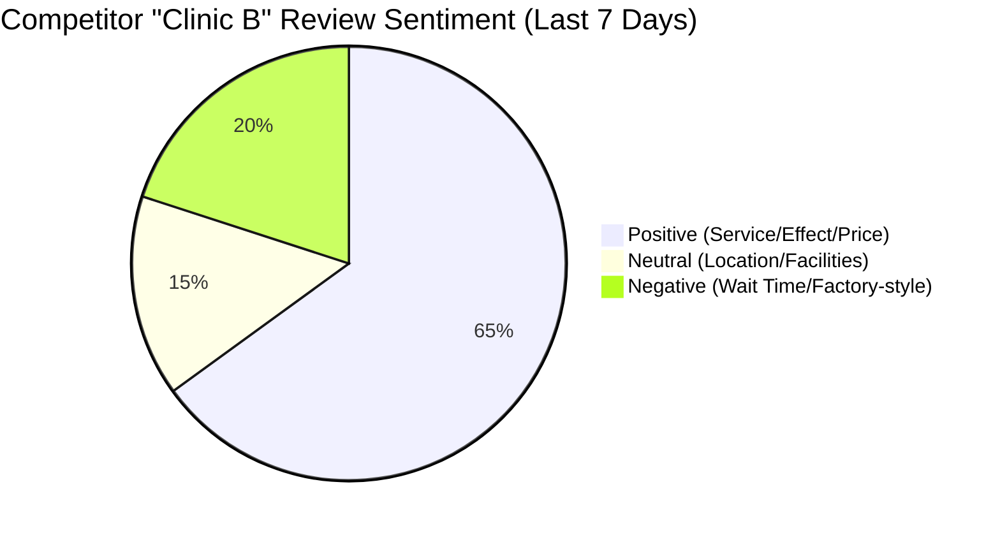

# 🏥 PP Clinic: Marketing & Competitor AI Intelligence Dashboard

> **Last Updated:** 2026-03-08 07:30 KST | **AI Automation Status:** 🟢 All Systems Operational

---

## 1. 📊 Executive Summary (Daily KPIs)

*Real-time metrics aggregating internal CRM, Naver Search, and SNS activity.*

| Metric | Current Value | Target (EOM) | MoM Growth | Status |
| :--- | :--- | :--- | :--- | :--- |
| **Total Inquiries (Inbound)** | 142 | 2,000 | 🔺 12% | 🟢 Good |
| **Naver Search Volume (Brand)**| 4,520 | 10,000 | 🔺 8% | 🟡 Ongoing |
| **SNS Total Engagement** | 12,450 | 30,000 | 🔺 25% | 🟢 Excellent|
| **Competitor SOV (Share of Voice)**| 15% | 25% | 🔺 2% | 🟡 Ongoing |

---

## 2. 🕵️‍♂️ Competitor Target Radar (Sinsa/Gangnam: Top 10)

*Data sourced via Automated Naver Blog Search API (Runs daily at 02:00 AM)*

### 🏆 Top Keywords & Vulnerabilities in Competitor Reviews
* **Clinic A (신사 뷰티의원):** "통증 (Pain) 📉", "대기시간 (Wait time) 📈", "원장님 친절 (Kindness) 🟢"
* **Clinic B (강남 스킨과):** "가격 (Price) 🟡", "공장형 (Factory-style) 🔴", "효과 (Effect) 🟢"
* **Clinic C (압구정 톡스):** "주차 (Parking) 🔴", "공장형 이벤트 (Event) 🟢", "재방문 (Revisit) 🟢"

### 📈 Sentiment Analysis Breakdown (AI Processed)

> [!TIP]
> **Actionable Insight:** Clinic B's patients are complaining about "Factory-style" and long wait times. We should launch an Instagram ad campaign highlighting our "1:1 Private Care" and "Zero Wait Time" policy targeting their demographic.

---

## 3. 📱 SNS Marketing Performance Control Center

*Data collected via AI Agents + Human Review Pipeline*

### 🚀 Platform Breakdown (Yesterday)

| Channel | Daily Posts (AI+Human) | Reach (Estimated) | Engagement Rate | Top Content Style |
| :--- | :--- | :--- | :--- | :--- |
| **Instagram (Reels)** | 2 | 15,200 | 4.2% | Before & After |
| **YouTube Shorts** | 1 | 8,500 | 5.1% | 원장님 Q&A |
| **Threads** | 5 | 2,100 | 1.8% | Text / 피부 꿀팁 |
| **Facebook** | 1 | 1,200 | 0.9% | Event Promo |

### 🔥 Viral Content Tracker (Top 3 This Week)
1. **[Reels]** "겨울철 피부 보습 홈케어 TOP 3" - 12.5k Views (Conversion: 15 inquiries)
2. **[Shorts]** "원장님이 직접 알려주는 OO시술 부작용" - 8.2k Views (Conversion: 8 inquiries)
3. **[Threads]** "오늘의 피부과 TMI (환자 썰)" - 150 Likes (High Engagement)

---

## 4. 🤖 AI Automation Agent Health Status

*Self-monitoring dashboard for all backend automation bots.*

| Agent Name | Function | Last Run | Status | Health |
| :--- | :--- | :--- | :--- | :--- |
| `ReviewCrawler-Agent` | Scrapes Top 10 Naver Place Reviews | 02:00 AM | `COMPLETED` | 🟢 100% |
| `SNS-Metrics-Agent` | Gathers Likes/Views/Comments (Threads/IG) | 06:00 AM | `COMPLETED` | 🟢 98% (Rate limit on FB) |
| `Plaud-to-Notion` | Syncs IR/Consulting audio notes to CRM | 07:15 AM | `COMPLETED` | 🟢 100% |

> [!WARNING]
> Facebook Graph API rate limit hit briefly at 06:10 AM. `SNS-Metrics-Agent` retried automatically and succeeded. No action required, but monitoring is advised.

---

## 5. 📝 Approvals & Backlog (Human-in-the-Loop)

*Tasks waiting for human manager review from the hybrid pipeline.*

- [x] **[SNS]** Approve AI-generated script for TikTok/Reels ("여드름 흉터 치료의 진실") (Approved by Jane)
- [ ] **[Ad]** Review A/B test ad creatives targeting "Clinic B" disappointed patients (Pending)
- [ ] **[Data]** Human verification of 5 ambiguous negative Naver reviews for Clinic C (Pending)
