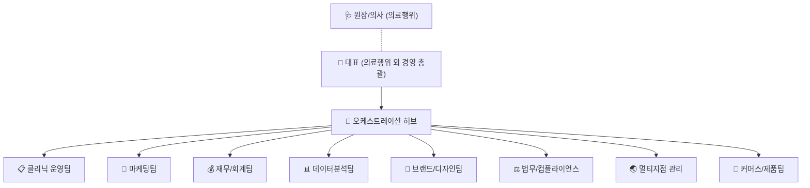
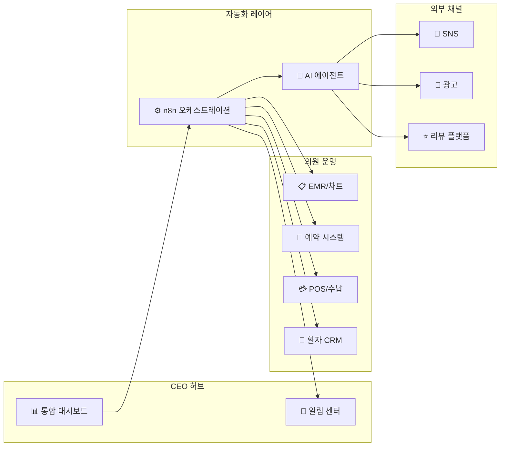

# 🏥 PP Clinic Roadmap — 1인 경영 운영 시스템 종합 로드맵
## 의료행위 외 전 영역 자동화 + 멀티 지점 확장 시스템

---

## 1. 사업 개요

**팽팽클리닉** = 미용 의원 (피부과/성형외과 계열)
- 의사(원장)는 **의료행위에 집중**, 나머지 모든 경영·운영을 **AI + 자동화 시스템**으로 커버
- 1호점 → 국내 다점포 → 해외 지점으로 **확장 가능한 구조** 설계
- 에이피알(APR) 스타일의 **D2C 뷰티 제품과의 시너지**도 고려



---

## 2. 팀 구성 & R&R

### 📋 팀 1: 클리닉 운영팀 — *의원의 심장*

| 역할 | R&R | 자동화 |
|------|-----|--------|
| **예약 관리** | 온라인/전화 예약, 스케줄 최적화, 노쇼 방지 | 자동 예약 시스템 + 리마인더 SMS |
| **접수/안내** | 신환 등록, 문진표, 동의서, 안내 | 디지털 문진표, 전자 동의서 |
| **간호/시술 보조** | (요 인력은 실제 채용 필수) 시술 보조, 장비 준비 | 시술 체크리스트 자동화 |
| **고객응대 (CS)** | 문의 응답, 불만 처리, 사후관리 안내 | AI 챗봇 + 자동 사후안내 문자 |
| **재고/소모품** | 시술 소모품, 의약품, 장비 재고 관리 | 자동 발주 알림, 소진율 추적 |
| **시설관리** | 청소, 장비 점검, 안전관리 | 점검 일정 자동 알림 |

> [!IMPORTANT]
> **간호조무사/간호사는 반드시 실제 인력 채용** 필요 (의료법상 의료기관 내 보조 업무)

### 📣 팀 2: 마케팅팀 — *환자를 데려오는 엔진*

| 역할 | R&R | 자동화 |
|------|-----|--------|
| **SNS 마케팅** | 인스타·유튜브·틱톡 시술 전후 콘텐츠 | AI 카피라이팅, 게시 스케줄러 |
| **블로그/SEO** | 네이버 블로그, 스마트플레이스 최적화 | AI 블로그 글 초안, 키워드 분석 |
| **CRM 마케팅** | 재방문 유도, 생일/시술주기 알림 | 자동 문자/카톡 시퀀스 |
| **퍼포먼스 광고** | 네이버·메타·구글 광고 운영 | 광고비 모니터링, ROAS 리포트 |
| **이벤트 기획** | 시즌 프로모션, 신규 시술 런칭 이벤트 | 이벤트 캘린더, 체크리스트 |
| **리뷰 관리** | 구글·네이버·강남언니 리뷰 관리 | 리뷰 알림, 감성분석, 답변 초안 |

> [!CAUTION]
> **의료광고 규제 필수 준수**: 치료효과 보장 금지, 비교/비방 금지, 수술장면 노출 금지, 심의 필수 등 의료법 제56조 엄수

### 💰 팀 3: 재무/회계팀

| 역할 | R&R | 자동화 |
|------|-----|--------|
| **매출 관리** | 일/월 매출 집계, 시술별 매출 분석 | POS 연동 자동 집계 |
| **세무/회계** | 부가세, 종합소득세/법인세 신고 | 자동 전표, 마감 리마인더 |
| **보험청구** | 건강보험 청구 (해당 시술) | 청구 프로그램 연동 |
| **비용 관리** | 인건비, 임대료, 소모품비 추적 | 예산 대비 실적 자동 비교 |
| **수익성 분석** | 시술별/원장별 수익률, 손익 분석 | 자동 P&L 리포트 |

### 📊 팀 4: 데이터분석팀

| 역할 | R&R | 자동화 |
|------|-----|--------|
| **환자 분석** | 재방문율, LTV, 이탈 예측 | AI 자동 세그먼트 |
| **시술 분석** | 인기 시술, 계절별 수요, 크로스셀 | 트렌드 리포트 자동 생성 |
| **운영 분석** | 대기시간, 회전율, 최적 예약 슬롯 | 운영 KPI 대시보드 |
| **시장 리서치** | 경쟁 의원 동향, 신기술/장비 트렌드 | AI 리서치 에이전트 |

### 🎨 팀 5: 브랜드/디자인팀

| 역할 | R&R | 자동화 |
|------|-----|--------|
| **BI/CI** | 로고, 인테리어 톤, 유니폼, 명함 | 가이드라인 문서화 |
| **콘텐츠 디자인** | SNS 소재, 시술 설명 카드, 배너 | AI 이미지 생성, 템플릿 |
| **영상 콘텐츠** | 시술 과정 영상, 인터뷰, 리뷰 영상 | AI 자막, 편집 자동화 |
| **원내 환경** | 대기실 디스플레이, 안내문, 메뉴판 | 디지털 사이니지 자동 업데이트 |

### ⚖️ 팀 6: 법무/컴플라이언스

| 역할 | R&R | 자동화 |
|------|-----|--------|
| **의료법 준수** | 의료광고 심의, 비의료행위 범위 관리 | 법규 변경 모니터링 |
| **인허가 관리** | 의료기관 개설신고, 각종 인증 | 갱신 기한 알림 |
| **개인정보 보호** | 환자 정보 보호, PIPA 준수 | 접근 로그, 보안 체크 |
| **계약 관리** | 임대, 장비, OEM 계약 관리 | 만기 알림, AI 계약 검토 |
| **보험/리스크** | 의료배상책임보험, 화재보험 등 | 갱신 알림 |

### 🌏 팀 7: 멀티지점 관리

| 역할 | R&R | 자동화 |
|------|-----|--------|
| **지점 개설** | 입지 분석, 인테리어, 인허가 | 개설 체크리스트 템플릿 |
| **SOP 관리** | 표준 운영 절차서 관리/배포 | 버전 관리, 교육 자동화 |
| **인력 관리** | 채용, 교육, 스케줄, 성과 평가 | 전자 근태, 교육 이력 추적 |
| **지점별 성과** | 매출/비용/환자수 비교 분석 | 지점 대시보드, 이상치 알림 |
| **해외 지점** | 현지 법규, 면허, 언어/문화 대응 | 번역, 현지 규정 리서치 |

### 🛒 팀 8: 커머스/제품팀 (성장기)

| 역할 | R&R | 자동화 |
|------|-----|--------|
| **자체 제품** | 원내 판매 화장품/건기식 기획 | 재고 추적, 매출 분석 |
| **온라인 판매** | 자사몰/스마트스토어/쿠팡 | 주문 동기화, 리뷰 관리 |
| **제휴** | OEM/ODM 업체 관리, 유통 계약 | 생산 일정 추적 |

---

## 3. 온라인 인프라 — 기술 스택

### 🖥️ 핵심 시스템 구성



### 📦 추천 SaaS & 도구 스택

| 카테고리 | 국내 추천 | 해외/대안 | 비고 |
|---------|----------|----------|------|
| **EMR (전자차트)** | 비트컴퓨터, 유비케어 | — | 의원급 필수 |
| **예약/CRM** | 똑닥, 캐치테이블포메디컬 | Zenoti, Pabau | 멀티지점 시 Zenoti 추천 |
| **환자 CRM** | TalkCRM AI, 베가스CRM | Clinicminds | EMR 연동 확인 |
| **POS/수납** | 바로빌, 여신금융협회 단말기 | — | 카드 단말 + POS |
| **회계/세무** | 삼일아이닷컴, 더존 | — | 세무사 연동 |
| **보험 청구** | 건강보험심사평가원 포털 | — | 급여 시술 시 |
| **자동화** | n8n (셀프호스팅) | Make, Zapier | n8n이 비용 효율적 |
| **AI 에이전트** | Claude API / OpenAI API | — | 팀별 에이전트 |
| **프로젝트관리** | Notion | ClickUp | OKR + 위키 |
| **커뮤니케이션** | Slack / 카카오톡 비즈 | Discord | 알림 채널 |
| **디자인** | Canva, Figma | AI 이미지 도구 | SNS 소재 제작 |
| **블로그/SEO** | 네이버 블로그, 스마트플레이스 | — | 국내 필수 |
| **리뷰관리** | 강남언니, 바비톡 | — | 미용의원 특화 |
| **화상상담** | Zoom, 카카오톡 | Clinicminds | 해외 환자용 |

---

## 4. 오프라인 인프라

### 🏥 지점 세팅 체크리스트

#### 법적 요건 (필수)
- [ ] **의료기관 개설신고** → 관할 보건소
- [ ] **사업자등록** → 세무서 (개설신고 후)
- [ ] **요양기관 등록** → 건강보험심사평가원
- [ ] **통신판매업 신고** → 온라인 제품 판매 시
- [ ] **의료배상책임보험** 가입
- [ ] **개인정보보호** 시스템 구축 (PIPA)
- [ ] **진단용 방사선장치 신고** → 해당 시

#### 공간 & 시설
| 구성 | 항목 | 초기 | 확장기 |
|------|------|------|--------|
| **진료공간** | 진료실, 시술실, 상담실, 대기실 | 전용 20~40평 | 50평+ |
| **장비** | 레이저, 고주파, 초음파 등 | 핵심 3~5개 | 전문화 |
| **IT 인프라** | EMR 서버, 네트워크, CCTV | 클라우드 EMR | 멀티지점 VPN |
| **소모품** | 시술재료, 화장품, 일회용품 | 3PL or 직접 | 중앙 구매 |

#### 인력 (최소 구성)
| 직책 | 인원 | 역할 | 비고 |
|------|------|------|------|
| 원장(의사) | 1+ | 진료·시술 | 의료행위 전담 |
| 간호조무사 | 2~3 | 시술 보조, 접수 | 의원급 최소 인원 |
| 코디네이터 | 0~1 | 상담, 시술 안내 | 성장 후 채용 |
| **나머지** | **AI** | **경영 전체** | **이 시스템의 핵심** |

---

## 5. 구축 로드맵

### 🔵 Phase 1: 기반 구축 (1~2주)

```
🎯 목표: 핵심 인프라 + CEO 대시보드 프로토타입
```

- [ ] Notion 워크스페이스 (팀별 공간 + OKR)
- [ ] **CEO 대시보드 웹앱** 개발
  - 일일: 예약 현황, 매출, 이슈
  - 주간: KPI 요약, 회의 브리핑
  - 지점별: 비교 대시보드 (확장 대비)
- [ ] Slack 채널 구조 (팀별 + 알림)
- [ ] n8n 워크플로우 엔진 세팅
- [ ] 개원 체크리스트 & 일정 관리

### 🟢 Phase 2: 의원 운영 시스템 (2~4주)

```
🎯 목표: 환자 여정 전체를 커버하는 운영 시스템
```

- [ ] EMR + 예약 시스템 연동
- [ ] 디지털 문진표 & 전자 동의서
- [ ] AI 챗봇 (카카오톡/웹) — CS 자동 응답
- [ ] 예약 리마인더 자동 발송
- [ ] 사후관리 안내 자동화 (시술 후 D+1, D+7)
- [ ] 재고/소모품 관리 시스템

### 🟡 Phase 3: 마케팅 & CRM 자동화 (4~8주)

```
🎯 목표: 환자 유입 + 재방문 자동화
```

- [ ] AI 마케팅 에이전트 (콘텐츠 초안 생성)
- [ ] SNS 자동 게시 + 콘텐츠 캘린더
- [ ] 네이버 블로그/스마트플레이스 최적화
- [ ] CRM 자동 시퀀스 (재방문 유도)
- [ ] 리뷰 모니터링 + 자동 답변 초안
- [ ] 퍼포먼스 광고 리포트 자동화

### 🟠 Phase 4: 오케스트레이션 + 데이터 (8~12주)

```
🎯 목표: 전체 시스템 통합 + 데이터 기반 의사결정
```

- [ ] 전체 워크플로우 오케스트레이션 완성
- [ ] AI 일일 브리핑 (아침 요약 → 저녁 리뷰)
- [ ] AI 주간 회의 시스템 (자동 안건 → 회의록)
- [ ] 환자 이탈 예측 + 자동 리텐션
- [ ] 시술별/시간대별 수익성 분석
- [ ] 이상 감지 & 에스컬레이션

### 🔴 Phase 5: 멀티지점 & 확장 (12주~)

```
🎯 목표: 2호점+ 개설, 해외 진출 기반
```

- [ ] 지점 개설 SOP (표준절차서) 완성
- [ ] 중앙집중 관리 대시보드 (지점 비교)
- [ ] 직원 온보딩/교육 시스템
- [ ] 해외 지점용 현지화 (법규, 언어)
- [ ] 자체 제품(화장품/건기식) D2C 런칭

---

## 6. 일일/주간 운영 사이클

### 📅 일일 사이클 (CEO 소요시간: ~30분)

```
08:00  🤖 AI 모닝 브리핑 자동 생성
       ├─ 오늘 예약 현황 & 특이사항
       ├─ 어제 매출 요약
       ├─ SNS/리뷰 신규 알림
       └─ 긴급 이슈 (재고 부족, 민원 등)

09:00  👤 CEO 대시보드 확인 (10분)
       └─ 승인/수정 필요 사항 처리

09:30  🤖 AI 에이전트 업무 자동 수행
~17:00 ├─ 마케팅: 오늘의 SNS 게시
       ├─ CS: 문의 자동 응답
       ├─ 재고: 소진 모니터링
       └─ 리서치: 경쟁 동향 수집

18:00  🤖 AI 저녁 리포트 자동 생성
       ├─ 오늘 매출 & 시술 건수
       ├─ 환자 만족도 & 이슈
       └─ 내일 예약 프리뷰

18:30  👤 CEO 리뷰 (15분)
       └─ 전략 방향 조정, 내일 우선순위
```

### 📅 주간 사이클

```
월요일  📋 AI 주간 목표 초안 → CEO 확정 (15분)
화~목   🔄 일일 사이클 반복
금요일  📊 AI 주간 리포트 자동 생성
       ├─ KPI 달성률 (매출, 환자수, 재방문율)
       ├─ 마케팅 성과 (유입, 전환, ROAS)
       ├─ 이슈/민원 총정리
       └─ 다음주 핵심 과제 제안
       👤 CEO 주간 회고 & 전략 (20분)
```

---

## 7. 함께 만들어갈 산출물 목록

| 순서 | 산출물 | 설명 | 우선순위 |
|------|--------|------|---------|
| ① | **CEO 통합 대시보드** | 예약·매출·KPI·이슈 한눈에 | ⭐⭐⭐ |
| ② | **팀별 R&R 상세 시트** | Notion 기반 업무 정의 & OKR | ⭐⭐⭐ |
| ③ | **개원 체크리스트** | 인허가, 시설, 장비, 인력 전체 | ⭐⭐⭐ |
| ④ | **AI 에이전트 프롬프트** | 팀별 AI 팀원 역할 정의 | ⭐⭐ |
| ⑤ | **자동화 워크플로우** | n8n 레시피 (예약·CS·마케팅) | ⭐⭐ |
| ⑥ | **주간회의 시스템** | 자동 안건 → 요약 → 회의록 | ⭐⭐ |
| ⑦ | **SOP 문서** | 지점 표준 운영 절차서 | ⭐ |
| ⑧ | **환자 여정 맵** | 유입 → 상담 → 시술 → 재방문 | ⭐ |

---

## 8. 다음 단계: 어디서부터 시작할까요?

> [!TIP]
> **추천**: ①번 **CEO 통합 대시보드**부터 시작 → 이후 모든 자동화의 허브가 됩니다.
> 
> 또는 개원 준비 중이라면 ③번 **개원 체크리스트**가 더 급할 수 있습니다.

1. **CEO 통합 대시보드** 웹앱 만들기
2. **팀별 R&R 상세화** (Notion)
3. **개원 체크리스트** (인허가·시설·장비·인력)
4. **AI 에이전트 설계** (프롬프트)
5. **순서대로 전부** 진행
